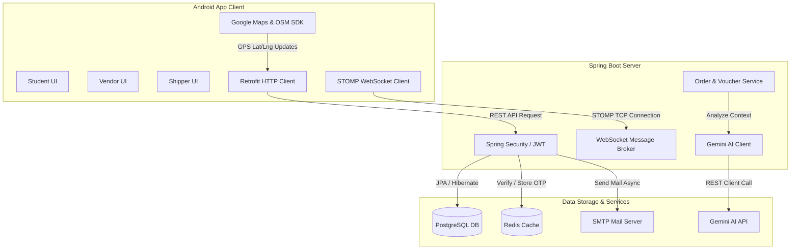

# 🍕 Food Ordering Android App
[](https://developer.android.com)
[](https://www.oracle.com/java/technologies/javase/jdk17-archive-downloads.html)
[](https://gradle.org)
[](LICENSE)
**Food Ordering App** là ứng dụng di động đặt đồ ăn chuyên biệt dành cho môi trường ký túc xá và khuôn viên trường đại học. Ứng dụng giải quyết bài toán giao nhận thực phẩm nhanh chóng, tối ưu hóa tuyến đường vận chuyển nội khu, tích hợp trí tuệ nhân tạo (AI) để gợi ý thực đơn cá nhân hóa và cung cấp trải nghiệm theo dõi đơn hàng thời gian thực. Hệ thống hỗ trợ đồng thời ba vai trò chính là **Sinh viên** (Khách hàng), **Chủ quán** (Vendor), và **Tài xế** (Shipper) hoạt động đồng bộ trên một nền tảng thống nhất.
---
## 📌 Mục lục (Table of Contents)
1. [Tính năng nổi bật (Key Features)](#-tính-năng-nổi-bật-key-features)
2. [Kiến trúc hệ thống (System Architecture)](#-kiến-trúc-hệ-thống-system-architecture)
3. [Yêu cầu hệ thống (System Requirements)](#-yêu-cầu-hệ-thống-system-requirements)
4. [Hướng dẫn cài đặt (Installation)](#-hướng-dẫn-cài-đặt-installation)
5. [Cấu hình (Configuration)](#-cấu-hình-cấu-hình)
6. [Hướng dẫn sử dụng (Usage)](#-hướng-dẫn-sử-dụng-usage)
7. [Quy trình đóng góp (Contributing)](#-đóng-góp-contributing)
8. [Tác giả & Liên hệ (Authors / Contact)](#-tác-giả--liên-hệ-authors--contact)
9. [Giấy phép (License)](#-giấy-phép-license)
---
## ✨ Tính năng nổi bật (Key Features)
Ứng dụng được thiết kế tối ưu với các công nghệ hiện đại nhằm mang lại trải nghiệm mượt mà nhất:
*   🔒 **Xác thực OTP & Sinh trắc học**: Xác minh đăng ký tài khoản qua mã OTP gửi tới Email sinh viên (lưu trữ tạm thời trên Redis Cache) và hỗ trợ đăng nhập nhanh bằng vân tay hoặc Face ID (`Biometric Authentication`).
*   ⚡ **Cập nhật đơn hàng Real-time**: Sử dụng giao thức **WebSocket STOMP** giúp kết nối liên tục giữa Sinh viên và Chủ quán. Chủ quán nhận thông báo đơn mới ngay lập tức không cần tải lại trang.
*   📍 **Định vị & Theo dõi Shipper**: Sinh viên có thể trực tiếp quan sát vị trí di chuyển của Shipper trên bản đồ thời gian thực (hỗ trợ cả **Google Maps SDK** và **OpenStreetMap** làm dự phòng).
*   🤖 **Trợ lý đề xuất món ăn AI**: Tích hợp mô hình **Google Gemini AI** (`gemini-1.5-flash`) phân tích khẩu vị sinh viên và gợi ý món ăn phù hợp nhất. Tự động chuyển sang thuật toán tìm kiếm dự phòng bằng từ khóa (Fallback Matcher) nếu mất kết nối AI.
*   🎫 **Áp dụng Voucher linh hoạt**: Hệ thống khuyến mãi thông minh hỗ trợ giảm giá theo số tiền cố định hoặc phần trăm, có ràng buộc giá trị đơn hàng tối thiểu và giới hạn món ăn áp dụng.
*   📊 **Biểu đồ thống kê doanh thu**: Chủ quán có thể theo dõi trực quan hiệu quả kinh doanh thông qua biểu đồ trực quan phát triển bởi thư viện `MPAndroidChart`.
---
## 🏗️ Kiến trúc hệ thống (System Architecture)
Sơ đồ dưới đây thể hiện sự tương tác giữa ứng dụng Android (Client), máy chủ Spring Boot (Backend Server) và các dịch vụ lưu trữ dữ liệu đi kèm:

---
## 📋 Yêu cầu hệ thống (System Requirements)
Để biên dịch và chạy dự án Android Client này một cách ổn định, máy tính của bạn cần đáp ứng các điều kiện sau:
*   **Hệ điều hành**: Windows 10/11, macOS, hoặc Linux.
*   **Java Development Kit (JDK)**: Phiên bản **Java 17** (đã cấu hình trong Gradle Toolchain).
*   **Android Studio**: Phiên bản **Koala** (2024.1.1) hoặc mới hơn.
*   **Android SDK**:
    *   `minSdkVersion`: **31** (Android 12)
    *   `targetSdkVersion`: **36** (Android 15 / 16 preview)
*   **Kết nối mạng**: Cần kết nối Internet để tải các thư viện Maven và kết nối tới API Server.
*   **Backend Server**: Cần chạy thành công dịch vụ backend Spring Boot kết nối PostgreSQL & Redis trước khi khởi động ứng dụng Android.
---
## 🚀 Hướng dẫn cài đặt (Installation)
Thực hiện lần lượt các bước sau để thiết lập mã nguồn dự án trên máy cục bộ của bạn:
### Bước 1: Clone mã nguồn từ GitHub
Mở terminal (hoặc Git Bash) và chạy lệnh sau:
```bash
git clone https://github.com/your-username/food-ordering-android-app.git
cd food-ordering-android-app
```
### Bước 2: Khởi tạo tệp cấu hình bí mật
Tạo một tệp tin có tên là `local.properties` tại thư mục gốc của dự án (nếu chưa có) và khai báo các khóa API cần thiết:
```properties
# Đường dẫn SDK Android trên máy của bạn (thường tự sinh bởi Android Studio)
sdk.dir=C\:\\Users\\YourUsername\\AppData\\Local\\Android\\Sdk
# Các khóa API phục vụ tính năng Bản đồ và Gợi ý AI
gemini.api.key=YOUR_GEMINI_API_KEY_HERE
GOOGLE_MAPS_API_KEY=YOUR_GOOGLE_MAPS_API_KEY_HERE
```
> [!WARNING]
> Không bao giờ được commit hoặc push tệp `local.properties` chứa các khóa API bảo mật lên các kho lưu trữ công cộng như GitHub. Tệp tin này đã được cấu hình trong `.gitignore` để tránh rò rỉ dữ liệu.
### Bước 3: Đồng bộ hóa Dự án (Gradle Sync)
1. Mở ứng dụng **Android Studio**.
2. Chọn **File** -> **Open** -> Trỏ đến thư mục `food-ordering-android-app`.
3. Chờ đợi Android Studio tự động tải các thư viện phụ thuộc (`Retrofit`, `StompProtocolAndroid`, `Glide`, `MPAndroidChart`, v.v.) và thực hiện đồng bộ hóa cấu hình Gradle (Gradle Sync).
---
## ⚙️ Cấu hình (Configuration)
### 1. Cấu hình Địa chỉ IP kết nối Backend Server
Địa chỉ API kết nối tới máy chủ Spring Boot được quản lý tập trung trong lớp [AppConstants.java](file:///d:/food-ordering-android-app/app/src/main/java/com/foodorderingapp/utils/constants/AppConstants.java):
```java
public class AppConstants {
    private static final String EMULATOR_BASE_URL = "http://10.0.2.2:8080/api/";
    private static final String USB_REVERSE_BASE_URL = "http://127.0.0.1:8080/api/";
    private static final String WIFI_BASE_URL = "http://192.168.1.105:8080/api/"; // Thay bằng IP WiFi của máy bạn
    ...
}
```
*   **Nếu chạy trên Emulator**: Ứng dụng tự động nhận diện và sử dụng địa chỉ `http://10.0.2.2:8080/api/` để trỏ về localhost của máy tính host.
*   **Nếu chạy trên Thiết bị thật qua cáp USB**: Chạy lệnh adb reverse dưới đây và giữ kết nối cục bộ.
*   **Nếu chạy trên Thiết bị thật qua Wi-Fi**: Thay đổi biến `REAL_DEVICE_BASE_URL` trỏ tới `WIFI_BASE_URL` với địa chỉ IP nội bộ chính xác của máy tính chạy server của bạn.
---
## 📖 Hướng dẫn sử dụng (Usage)
### 1. Chạy chuyển tiếp cổng (Port Forwarding) khi kiểm thử thiết bị thật
Nếu bạn kết nối điện thoại Android vật lý vào máy tính qua cáp USB để kiểm thử, hãy mở Command Prompt / PowerShell và chạy lệnh sau để thiết bị di động có thể truy cập thẳng vào server cục bộ `localhost:8080`:
```bash
adb reverse tcp:8080 tcp:8080
```
### 2. Biên dịch và Khởi chạy ứng dụng
*   **Sử dụng Android Studio**: Chọn thiết bị ảo (Emulator) hoặc điện thoại vật lý đã kết nối ở thanh công cụ phía trên, bấm nút **Run** (biểu tượng tam giác màu xanh lá) hoặc nhấn tổ hợp phím `Shift + F10` (Windows) / `Control + R` (macOS).
*   **Sử dụng dòng lệnh (CLI)**: Để cài đặt trực tiếp ứng dụng lên thiết bị đang kết nối bằng lệnh Gradle:
    ```bash
    ./gradlew installDebug
    ```
### 3. Demo Luồng Đặt Hàng & Quản Lý Đơn Hàng
|
 Vai trò người dùng 
|
 Giao diện màn hình 
|
 Mô tả luồng hoạt động chính 
|
|
:---
|
:---
|
:---
|
|
**
Sinh Viên
**
 (Customer) 
|
`MainActivity`
, 
`CheckoutActivity`
|
 Đăng ký -> Nhận OTP qua email -> Nhập OTP xác thực -> Đăng nhập. Chọn món ăn vào giỏ hàng -> Áp dụng Voucher giảm giá -> Đặt hàng -> Theo dõi hành trình Shipper và chat trực tiếp. 
|
|
**
Chủ Quán
**
 (Vendor) 
|
`VendorMainActivity`
|
 Quản lý thông tin cửa hàng, giờ đóng/mở cửa, tạo mới thực đơn. Nhận thông tin đơn hàng thời gian thực qua WebSocket, tiến hành chuẩn bị món ăn (
`PREPARING`
) và báo hoàn thành (
`PREPARED`
). 
|
|
**
Tài Xế
**
 (Shipper) 
|
`ShipperMainActivity`
|
 Xem danh sách các đơn hàng đang chờ giao. Bấm nhận đơn -> Hệ thống tự động kích hoạt GPS Background Service để cập nhật tọa độ liên tục lên server -> Giao hàng thành công. 
|
---
## 🤝 Đóng góp (Contributing)
Chúng tôi rất hoan nghênh và đánh giá cao mọi đóng góp giúp tối ưu hóa ứng dụng. Quy trình thực hiện đóng góp như sau:
1. **Fork** dự án này về tài khoản cá nhân của bạn.
2. Tạo một nhánh mới để phát triển tính năng (Feature Branch):
   ```bash
   git checkout -b feature/awesome-feature
   ```
3. Commit các thay đổi của bạn kèm theo thông điệp rõ ràng:
   ```bash
   git commit -m "feat: thêm tính năng gợi ý món ăn thông minh"
   ```
4. Push nhánh của bạn lên remote repository:
   ```bash
   git push origin feature/awesome-feature
   ```
5. Truy cập trang gốc dự án và mở một **Pull Request (PR)** để đội ngũ phát triển kiểm duyệt.
---
## 👨‍💻 Tác giả & Liên hệ (Authors / Contact)
*   **Đội ngũ phát triển dự án**: Nhóm phát triển Food Ordering App
*   **Email hỗ trợ**: support@student.edu.vn
*   **GitHub Repository**: [food-ordering-android-app](https://github.com/DonThuanUIT/food-ordering-android-app)
Mọi thắc mắc hoặc báo lỗi liên quan đến ứng dụng, vui lòng mở một **Issue** trên trang GitHub của dự án hoặc liên hệ qua địa chỉ Email phía trên để được hỗ trợ kịp thời.
---
## 📄 Giấy phép (License)
Dự án này được cấp phép hoạt động dưới các điều khoản của **Giấy phép MIT** (MIT License). Bạn hoàn toàn có quyền sao chép, chỉnh sửa và phân phối lại mã nguồn này cho cả mục đích cá nhân lẫn thương mại. Xem chi tiết tại tệp [LICENSE](LICENSE) (nếu có).
# food-ordering-android-app  
